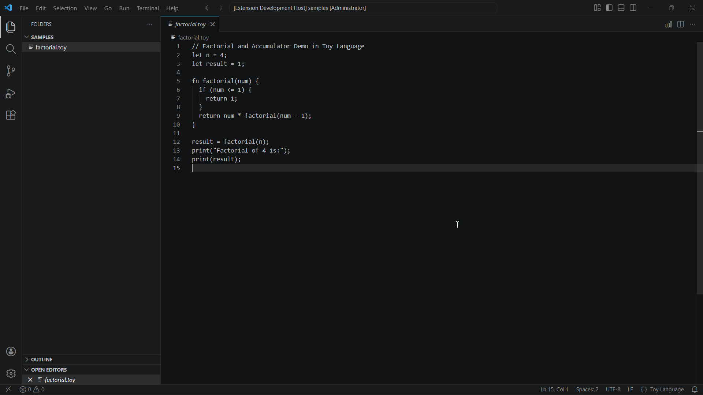

# AST Graph extension for Visual Studio Code

View an interactive AST Graph of your code, step through execution with a time-traveling tree-walk interpreter, and inspect scopes, tokens, and runtime evaluation directly within Visual Studio Code.



## Features

* AST Graph View:
  * Display:
    * Hierarchical railway tracks linking AST nodes across nesting levels with smooth cubic bezier curves
    * Structured outline table with slot labels and category badges (Stmt, Expr, Literal, Ident, Fn)
    * Real-time result values displayed in inline badges alongside evaluated expressions
    * Scope mutation summaries showing variable declarations and assignments
    * Source code line and column position references
  * Stepping and Time-Travel Controls (available on the top control bar):
    * Step Forward, Step Backward, Play / Pause, and Reset
    * Live step counter showing current progress and total step count
    * Breadcrumb path indicator tracking active node hierarchy
  * Node Details View (available by clicking on any AST row):
    * View the complete JSON structure of the selected AST node
    * Dedicated graph column keeps railway tracks clean and unobstructed
    * Click anywhere on the row to toggle, or click the close button
  * Diagnostic Tabs:
    * AST Graph: The primary interactive execution table and railway graph
    * Tokens: Complete token stream matrix with category filters (All, Keyword, Ident, Literal, Operator, Punct) and line:column positions
    * Scopes: Hierarchical lexical environment inspection displaying scope frames and current variable bindings
    * Console: Standard output terminal displaying program print outputs and total execution time in milliseconds
  * Editor Synchronization:
    * Clicking any graph vertex or table row immediately centers and highlights the corresponding source code range in the active editor

## Extension Commands

This extension contributes the following commands to the Command Palette:

* `astGraph.view`: AST Graph: View AST Graph
* `astVisualizer.open`: Legacy alias for backwards compatibility

The view can also be launched directly by clicking the graph icon in the editor tab title bar when a supported file is open.

## Supported Languages

AST Graph provides native and WebAssembly-powered AST parsing across major programming languages:

* JavaScript & TypeScript (`.js`, `.jsx`, `.ts`, `.tsx`, `.mjs`, `.cjs`): Native AST and token stream extraction powered by the TypeScript compiler API.
* Python (`.py`): WebAssembly Tree-sitter parser with functions, classes, decorators, and control flow.
* C & C++ (`.c`, `.cpp`, `.cc`, `.cxx`, `.h`, `.hpp`): Translation units, functions, structs, and preprocessor directives.
* C# (`.cs`): Namespaces, classes, methods, and properties.
* Rust (`.rs`), Go (`.go`), Java (`.java`), Ruby (`.rb`), PHP (`.php`), Bash (`.sh`): Native AST hierarchy via Tree-sitter WASM.
* Data formats: JSON (`.json`), YAML (`.yaml`, `.yml`), TOML (`.toml`).
* Toy Language (`.toy`): Built-in educational language with time-traveling stepped execution, live scope frames, expression evaluation badges, and terminal output.

## Architecture

The codebase adheres strictly to Clean Architecture and Domain-Driven Design (DDD) principles:

```
vsc_extension/
├── src/
│   ├── shared/                # Zero-dependency models, types, and protocol messages
│   │   ├── AstNodeTypes.ts    # Discriminated union of AST nodes
│   │   ├── SourceLocation.ts  # Line and column coordinates
│   │   ├── StepSnapshot.ts    # Immutable execution snapshots
│   │   └── ProtocolMessages.ts# Extension Host <-> Webview message contracts
│   ├── domain/                # Pure domain logic (Zero VS Code or DOM dependencies)
│   │   ├── lexer/             # Tokenizer and Token definitions
│   │   ├── parser/            # Recursive-descent parser and token stream
│   │   ├── interpreter/       # Tree-walk interpreter, environments, and runtime values
│   │   └── layout/            # Table layout calculations and SVG bezier path generation
│   ├── application/           # Application orchestration
│   │   ├── SnapshotHistory.ts # Time-travel index management
│   │   └── InterpreterSession.ts # Session coordinator and playback timer
│   ├── infrastructure/        # VS Code adapters
│   │   ├── extension.ts       # Extension entry point and command registration
│   │   ├── WebviewPanelManager.ts # Webview lifecycle and security policy
│   │   └── WebviewRpcBridge.ts # Typed message dispatcher
│   └── webview/               # High-performance Vanilla Webview UI
│       ├── app/
│       │   ├── AstTableGraphRenderer.ts # Table and SVG railway tracks renderer
│       │   ├── TopControlsToolbar.ts    # Pinned player controls and breadcrumbs
│       │   ├── TokenMatrixView.ts       # Token stream matrix tab
│       │   ├── ScopeChainView.ts        # Scope frames inspector tab
│       │   ├── ConsoleOutputView.ts     # Terminal output view tab
│       │   └── WebviewApp.ts            # Client application root
│       └── styles/styles.ts   # VS Code theme-aware CSS stylesheets
```

## Getting Started

### Prerequisites

* Node.js 18.x or higher
* npm 9.x or higher
* Visual Studio Code 1.85.0 or higher

### Installation & Build

1. Clone this repository:
   ```bash
   git clone https://github.com/your-username/vsc_extension.git
   cd vsc_extension
   ```

2. Install dependencies:
   ```bash
   npm install
   ```

3. Compile the extension and webview bundles:
   ```bash
   npm run compile
   ```

   For continuous compilation during development:
   ```bash
   npm run watch
   ```

### Debugging with F5

1. Open this project folder in Visual Studio Code.
2. Press `F5` (or select `Run Extension` from the Run & Debug panel).
3. In the new Extension Development Host window:
   * Open a sample program, such as `samples/factorial.toy`.
   * Click the graph icon in the editor tab title bar, or press `Ctrl+Shift+P` (`Cmd+Shift+P` on macOS) and run:
     ```
     AST Graph: View AST Graph
     ```
   * Use the toolbar controls to step forward, step back, play, pause, or inspect nodes.

## Running Tests

Execute the automated test suite:

```bash
npm test
```

The test suite validates:
* Lexer tokenization with accurate source locations
* Recursive-descent AST parser correctness and operator precedence
* Tree-walk interpreter generator steps, variable scopes, closures, loops, and standard output
* Strict TypeScript compilation without errors (`npx tsc --noEmit`)
